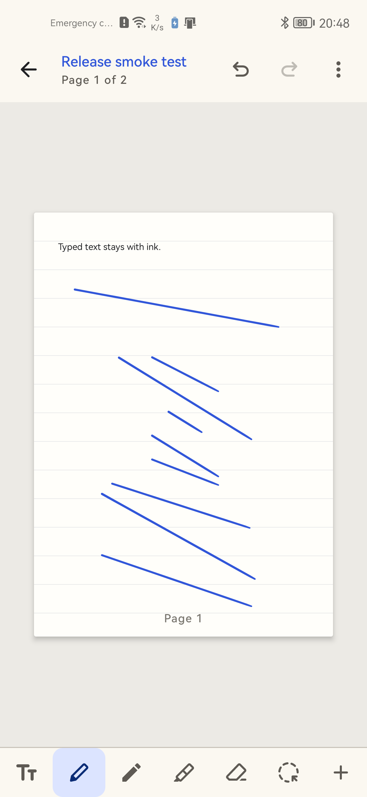
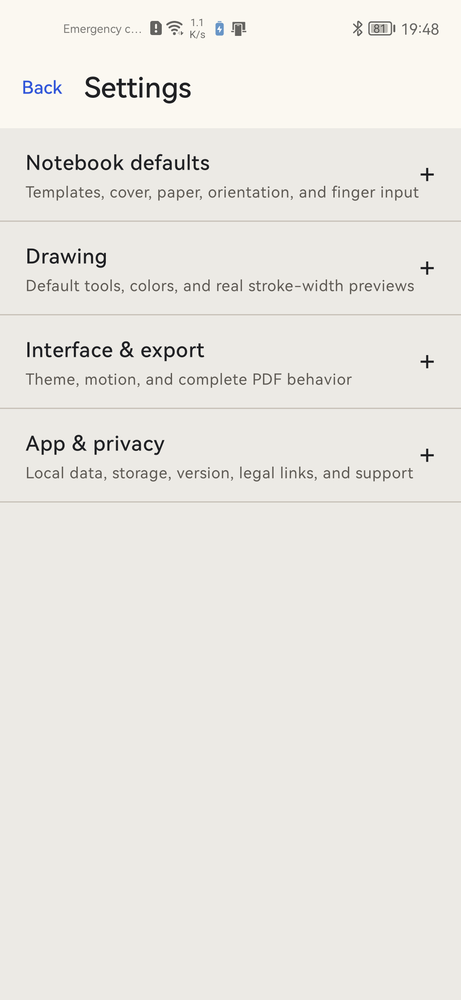

# SeliaSheets

[](https://github.com/Majkey25/SeliaSheets/actions/workflows/android.yml)
[](https://developer.android.com/about/versions/10)
[](https://github.com/Majkey25/SeliaSheets/releases)
[](LICENSE)

<p align="center">
  
</p>

SeliaSheets is a private, offline-first Android notebook for students. It combines ordered paper pages, AndroidX Ink, full-page typing, chapters, imported PDFs, images, smart shapes, local arithmetic, and editable backups.

## Highlights

- Android 10 and later (`minSdk 29`; compiled and targeted for API 37).
- AndroidX Ink with pressure, stylus eraser, palm cancellation, and motion prediction.
- Pen, pencil, highlighter, segment and whole-stroke erasers, polygon lasso selection, and up to 100-step undo/redo.
- Custom RGB/hex brush colors, continuous width controls, and pen/pencil/highlighter opacity with live previews.
- Multiple notebooks with covers, chapters, page titles, bookmarks, search across stored titles, text, and math, favorites, and trash.
- Second-notebook workspace with a resizable tablet split or a keyboard-aware phone dialog. Each pane keeps its own page, draft, and zoom; a shared page has one writable pane.
- Add a note page or PDF slides after the current page. Inserted notes preserve the current page dimensions and chapter.
- Four illustrated starting templates with a live cover, paper, and orientation preview.
- Blank, ruled, grid, and dot paper in portrait or landscape.
- Private image import through Android Photo Picker with MIME, dimension, allocation, and corruption checks.
- Bundled on-device Latin OCR makes imported image text searchable and can be disabled in Settings.
- Direct full-page typing plus movable text boxes and private Photo Picker image import.
- Isolated-process PDF import, text selection, and editable highlights, underlines, and strikeouts. Scanned pages and Android 10–14 use local OCR when enabled.
- Search PDF body text and stored text marks, then open the matching page region. Search is bounded to 100 results and reports pages it cannot search.
- Linked text excerpts and cropped page images, including annotations and ink, with navigation back to their source page.
- Draw-and-hold lines, arrows, ellipses, rectangles, and triangles with preserved pen color, opacity, width, raw-ink Undo, and shape Redo.
- PDF export containing every page, paper pattern, ink, text, image, shape, math result, and imported PDF background.
- PDF export is flattened. Editable annotations and original PDF sources remain in notebook backups.
- Portable `.seliasheets` backups with validation, merge, replace, and rollback protection.
- Working settings for default tools, widths, finger drawing, paper, orientation, theme, and motion.
- No first-party account, ads, analytics, telemetry, or cloud sync.
- Optional on-device handwriting recognition for simple single-line arithmetic after an explicit Google model download.

## Screenshots

| Phone editor | Settings |
| --- | --- |
|  |  |

## Privacy

Hosted policies: [Privacy](https://majkey25.github.io/SeliaSheets/privacy/) · [Terms and conditions](https://majkey25.github.io/SeliaSheets/terms/) · [Refunds](https://majkey25.github.io/SeliaSheets/refunds/) · [Cookies](https://majkey25.github.io/SeliaSheets/cookies/). The app's existing **Privacy policy** and **Source code** buttons lead to these links.

Notebook content, raw ink, OCR text, and recognition results stay in private app storage unless the user exports them. Image text recognition is enabled by default for imported images and can be disabled in Settings. Handwriting recognition is off by default and requires an explicit Google model download. Google ML Kit processes recognition input and output on-device but collects SDK metadata and metrics for diagnostics and usage analytics. See the [privacy policy](PRIVACY.md) and [Google Play data-safety notes](docs/play-store/DATA_SAFETY.md).

## Build

Requirements: JDK 17 and Android SDK platforms 29 and 37.

```bash
./gradlew testDebugUnitTest lintDebug assembleDebug assembleDebugAndroidTest assembleRelease bundleRelease
```

The default release bundle is unsigned. Publication uses an external upload keystore that is never committed. See [release signing](docs/RELEASE.md).

## Verification

The PDF study increment adds screen-pixel, export-pixel, linked-excerpt, migration, backup, and real input-routing checks. See the [PDF study verification record](docs/qa/2026-09-12-pdf-study-tools.md). Current backups use format 7 for shape styles and require an updated reader; formats 1–6 remain readable.

Version `0.8.0-beta.2` adds workspace, PDF search, shape-style preservation, and import recovery. See the [workspace/search verification record](docs/qa/2026-09-12-workspace-search.md) for completed checks and limits.

The [September 19 capability comparison](docs/qa/2026-09-19-notes-and-drawing-comparison.md) separates documented competitor workflows, current changes, and missing graphics/study features. Name fields use native Compose text-input behavior; direct stylus handwriting requires a compatible Android 14+ device and keyboard.

Live highlighter checks compare native screen pixels before pen-up and after handoff at fit, zoom, pan, and after pinching. A separate editor test checks visibility after saving without a tool switch. See the [highlighter regression record](docs/qa/2026-09-12-highlighter-visibility.md).

`0.6.2-beta.1` handles barrel-button changes while writing and preserves pending ink before Back, Undo, and page navigation. Huawei runs reported 58 input tests and 77 nearby editor tests, with overlap and three expected input/API skips. The signed APK passed a native-window ink pixel check; 100 JVM tests passed. See the [verification record](docs/qa/2026-09-08-stylus-handoff.md) for evidence and limits. Physical active-pen hardware still requires a compatible test device. Format-5 backups require an updated reader; formats 1–4 remain readable.

## Scope

This beta does not include movable/resizable phone pop-ups, process-death workspace restoration, FLOW pages, Quick Note and Inbox, rich-text styles, tables, graphs, study sets, masking tape, audio, accounts, cloud sync, or collaboration. Native PDF search does not OCR embedded scanned regions on mixed-content pages. Optional handwriting recognition supports only simple single-line arithmetic candidates; it is not general two-dimensional math or LaTeX recognition. Typed arithmetic and confirmed shape cleanup work locally without a downloaded model. Hardware-specific pressure, tilt, hover, eraser, and side-button behavior still requires QA on a compatible active-stylus device.

## Support

Optional support does not unlock features or change priority: [Buy Me a Coffee](https://www.buymeacoffee.com/majkey).

For bugs and feature requests, use [GitHub Issues](https://github.com/Majkey25/SeliaSheets/issues). For privacy questions, email [majkeylab@gmail.com](mailto:majkeylab@gmail.com).

## License

Copyright © 2026 Majkey25. Licensed under the [Apache License 2.0](LICENSE). Third-party components retain their respective licenses; see [THIRD_PARTY_NOTICES.md](THIRD_PARTY_NOTICES.md).
