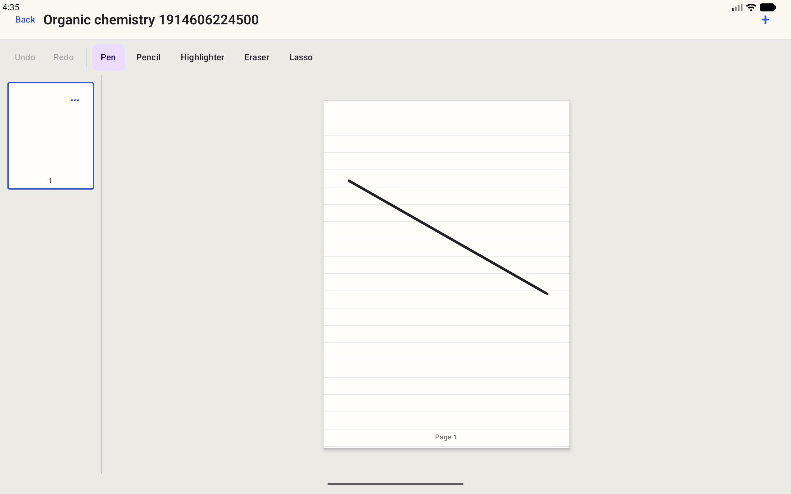
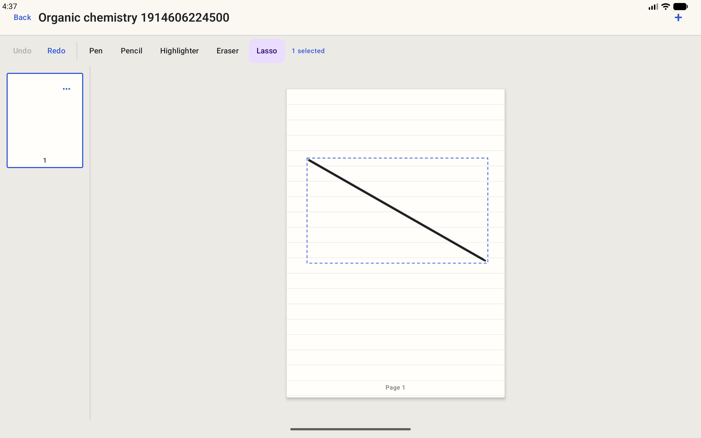
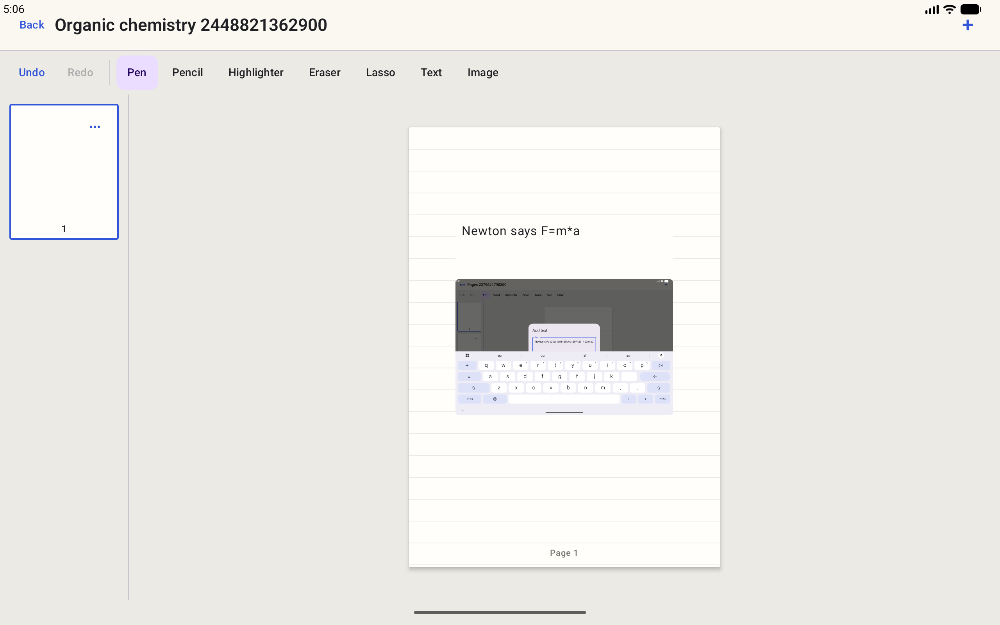
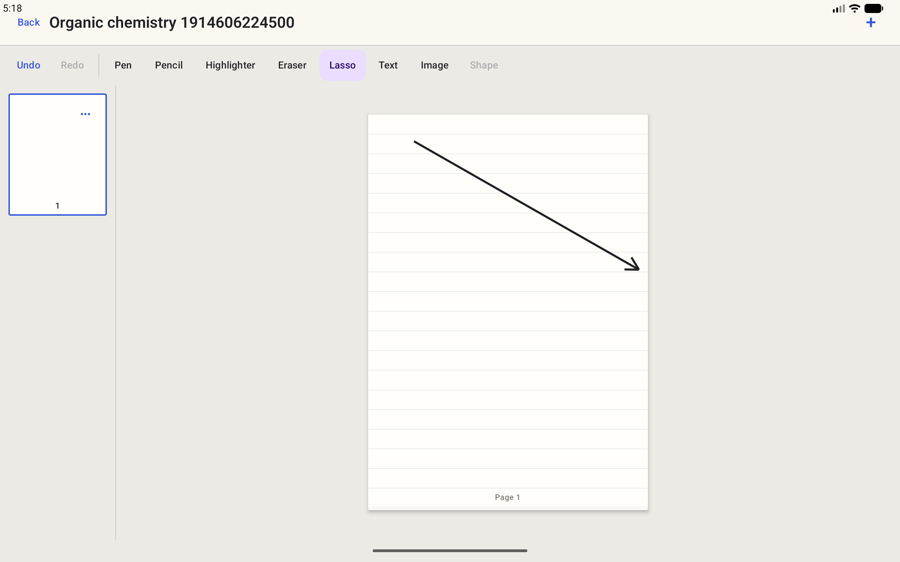
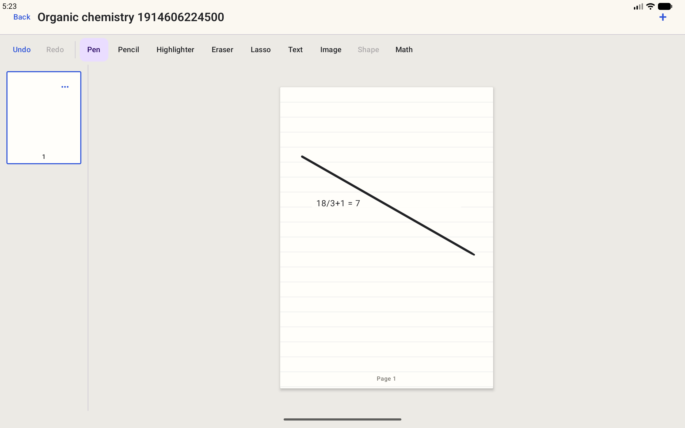
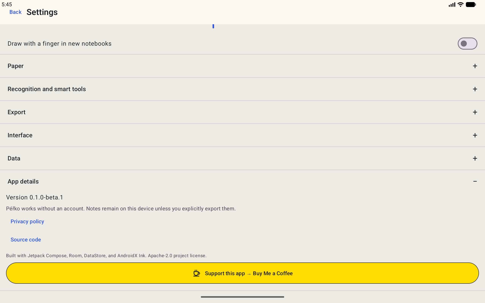
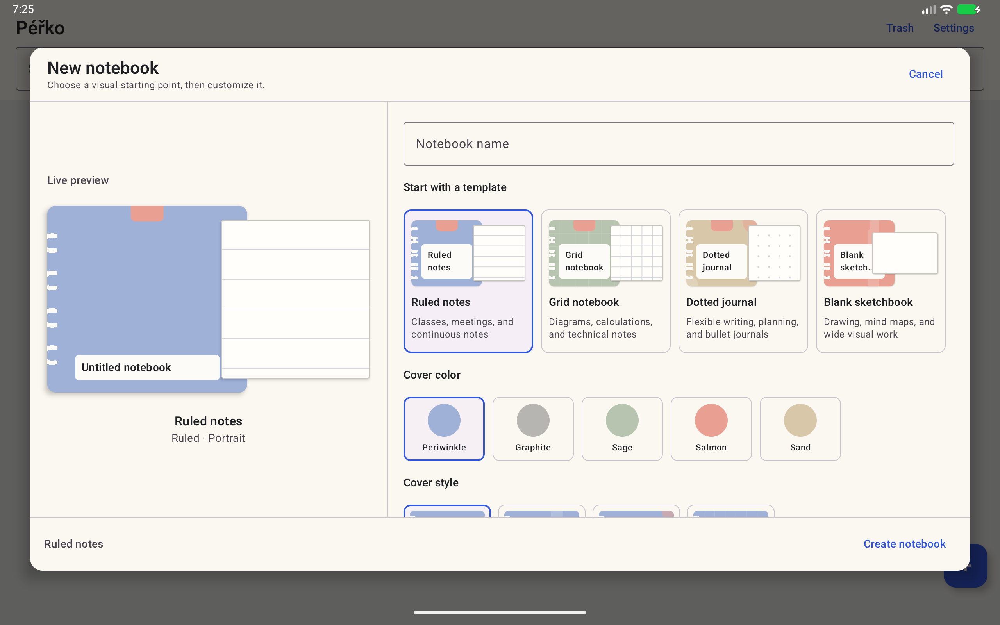
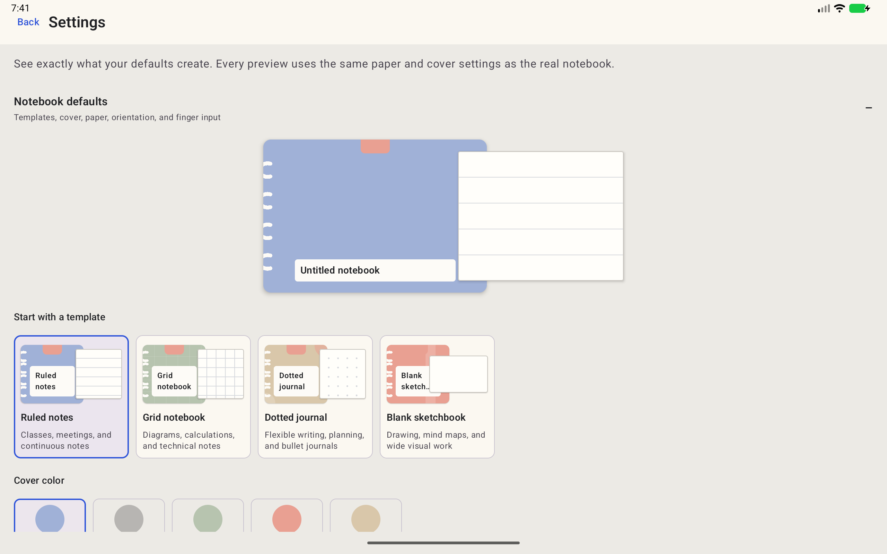

# SeliaSheets

[](https://github.com/Majkey25/SeliaSheets/actions/workflows/android.yml)
[](https://developer.android.com/about/versions/10)
[](https://github.com/Majkey25/SeliaSheets/releases)
[](LICENSE)

<p align="center">
  
</p>

SeliaSheets is a private, offline-first Android notebook for students. It combines ordered paper pages, AndroidX Ink, full-page typing, chapters, imported PDFs, images, smart shapes, local arithmetic, and editable backups.

## Highlights

- Android 10 and later (`minSdk 29`; compiled and targeted for API 37).
- AndroidX Ink with pressure, stylus eraser, palm cancellation, and motion prediction.
- Pen, pencil, highlighter, segment and whole-stroke erasers, polygon lasso selection, and up to 100-step undo/redo.
- Multiple notebooks with covers, chapters, page titles, bookmarks, search across stored titles, text, and math, favorites, and trash.
- Four illustrated starting templates with a live cover, paper, and orientation preview.
- Blank, ruled, grid, and dot paper in portrait or landscape.
- Private image import through Android Photo Picker with MIME, dimension, allocation, and corruption checks.
- Bundled on-device Latin OCR makes imported image text searchable and can be disabled in Settings.
- Direct full-page typing plus movable text boxes and private Photo Picker image import.
- Isolated-process PDF import and annotation with editable source preservation.
- Draw-and-hold lines, arrows, ellipses, rectangles, and triangles with raw-ink Undo and shape Redo.
- PDF export containing every page, paper pattern, ink, text, image, shape, math result, and imported PDF background.
- Portable `.seliasheets` backups with validation, merge, replace, and rollback protection.
- Working settings for default tools, widths, finger drawing, paper, orientation, theme, and motion.
- No first-party account, ads, analytics, telemetry, or cloud sync.
- Optional on-device handwriting recognition for simple single-line arithmetic after an explicit Google model download.

## Screenshots

| Notebook editor | Lasso selection |
| --- | --- |
|  |  |

| Text and image | Shape cleanup |
| --- | --- |
|  |  |

| Local math | App details |
| --- | --- |
|  |  |

| Visual notebook creator | Visual defaults |
| --- | --- |
|  |  |

## Privacy

Notebook content, raw ink, OCR text, and recognition results stay in private app storage unless the user exports them. Image text recognition is enabled by default for imported images and can be disabled in Settings. Handwriting recognition is off by default and requires an explicit Google model download. Google ML Kit processes recognition input and output on-device but collects SDK metadata and metrics for diagnostics and usage analytics. See the [privacy policy](PRIVACY.md) and [Google Play data-safety notes](docs/play-store/DATA_SAFETY.md).

## Build

Requirements: JDK 17 and Android SDK platforms 29 and 37.

```bash
./gradlew testDebugUnitTest lintDebug assembleDebug assembleDebugAndroidTest assembleRelease bundleRelease
```

The default release bundle is unsigned. Publication uses an external upload keystore that is never committed. See [release signing](docs/RELEASE.md).

## Verification

`0.6.0-beta.1` adds a Pencil brush that responds throughout each stroke to pressure, tilt, and orientation. It also adds a non-writing stylus hover preview, direct selected-ink editing, inline text drafts that survive Activity recreation, and backup validation that rejects oversized, malformed, or unreferenced data. The release targets API 37, but current API 37 runtime acceptance and physical active-stylus behavior remain unverified. Default release builds remain unsigned unless the external upload keystore is supplied.

## Scope

This beta does not include FLOW pages, Quick Note and Inbox, rich-text styles, tables, graphs, study sets, masking tape, audio, accounts, cloud sync, or collaboration. Optional handwriting recognition supports only simple single-line arithmetic candidates; it is not general two-dimensional math or LaTeX recognition. Typed arithmetic and confirmed shape cleanup work locally without a downloaded model. Hardware-specific pressure, tilt, hover, eraser, and side-button behavior still requires QA on a compatible active-stylus device.

## Support

Optional support does not unlock features or change priority: [Buy Me a Coffee](https://www.buymeacoffee.com/majkey).

For bugs and feature requests, use [GitHub Issues](https://github.com/Majkey25/SeliaSheets/issues). For privacy questions, email [majkeylab@gmail.com](mailto:majkeylab@gmail.com).

## License

Copyright © 2026 Majkey25. Licensed under the [Apache License 2.0](LICENSE). Third-party components retain their respective licenses; see [THIRD_PARTY_NOTICES.md](THIRD_PARTY_NOTICES.md).
